     

<h1 align="center">
Coding Challenges
</h1>

Code Challenges in: Css, Javascript, TypeScript, React, React Native..

  <a href="#rocket-about-this-project">About this project</a>&nbsp;&nbsp;&nbsp;|&nbsp;&nbsp;&nbsp;
  <a href="#💻-challenges">Challenges</a>&nbsp;&nbsp;&nbsp;|&nbsp;&nbsp;&nbsp;
  <a href="#memo-license">License</a>

  

 
 

## :rocket: About this project

 
This app features all the latest tools and practices in mobile development!
 
 

- <a href="#📌-shuffle-the-name">Shufle the name</a>
- <a href="#📌-four-letter-string">Four letter String</a>
- <a href="#📌-negate-the-array-of-numbers">Negate the Array of Numbers</a>
- <a href="#📌-seven-boom">Seven Boom!</a>
- <a href="#📌-largest-swap">Largest Swap</a>

 
 

## 💻 Challenges

 

### 📌 Shuffle the Name

#### Description:

Create a <strong>function</strong> that accepts a <strong>string</strong> (of a person's first and last name) and return a string with the first and last name <strong>swapped</strong>.

#### Expected Result:

nameShuffle("Otacilio Fox") ⟶ "Fox Otacilio"

nameShuffle("Linus Torvalds") ⟶ "Torvalds Linus"

nameShuffle("Rosie O'Donnell") ⟶ "O'Donnell Rosie"

     

 

### 📌 Four letter String

#### Description:

Create a <strong>function</strong> that takes an <strong>array of strings</strong> and returns the <strong>words</strong> that are exactly <strong>four letters</strong>.

#### Expected Result:

isFourLetters(["Tomato", "Potato", "Pair"]) ⟶ ["pair"]

isFourLetters(["kangaroo", "Bear", "Fox"]) ⟶ ["Fox"]

isFourLetters(["Ryan", "Kieran", "Jason", "Matt"]) ⟶ ["ryan", "Matt"]

     

 

### 📌 Negate the Array of Numbers

#### Description:

Given an array of numbers, negate all elements contained within.

#### Expected Result:

negate([1, 2, 3, 4]) ⟶ [-1, -2, -3, -4]

negate([-1, -2, -3, -4]) ⟶ [1, 2, 3, 4]

     

 

### 📌 Seven Boom!

#### Description:

Create a <strong>function</strong> tha takes an <strong>array of numbers</strong> and return <strong>"Boom!"</strong> if the number <strong>7 appears in the array.</strong>
Otherwise, return "there is no 7 in the array".

#### Expected Result:

sevenBoom([1, 2, 3, 4, 5, 6, 7]) ⟶ "Boom!"

sevenBoom([8, 6, 33, 100]) ⟶ "there is no 7 in the array"

sevenBoom([2, 55, 60, 97, 86]) ⟶ "Boom!"

     

 

### 📌 Largest Swap

#### Description:

Write a <strong>function</strong> that takes a <strong>two-digit</strong> number and determines if it's the <strong>largest</strong> of two possible digits <strong>swaps</strong>.

To illustrate:  
&nbsp;&nbsp;&nbsp; largestSwap(27) ⟶ false

clue: 
&nbsp;&nbsp;&nbsp; input = 27 
&nbsp;&nbsp;&nbsp; swapped = 72  
&nbsp;&nbsp;&nbsp; 27 > 72 = false  

#### Expected Result:

largestSwap(14) ⟶ <strong>false</strong>

largestSwap(53) ⟶ <strong>true</strong>

largestSwap(99) ⟶ <strong>true</strong>

     

 
 

## :memo: License

 
This project is licensed under the MIT License - see the details in <a href="https://opensource.org/licenses/MIT">page</a>.

---

Make with :purple_heart:
